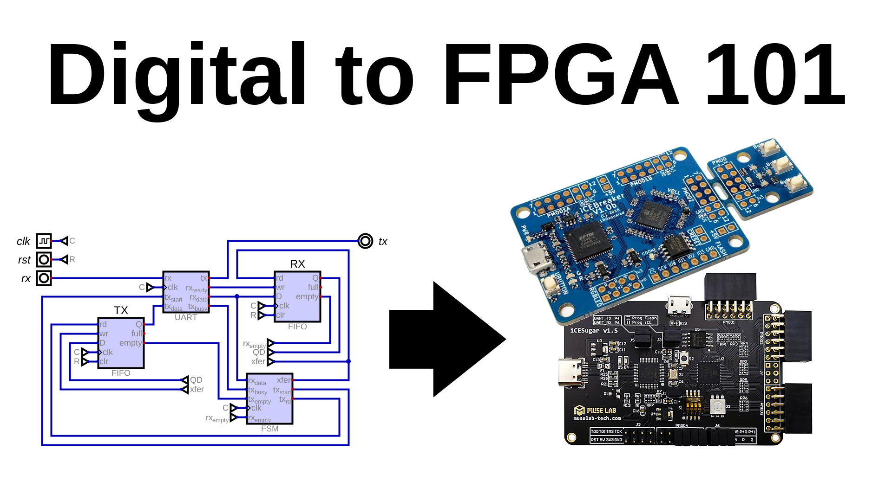
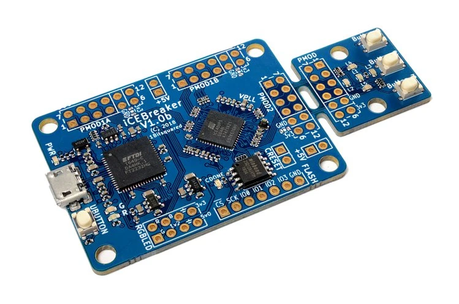

---

# Digital to FPGA 101

A tutorial for electronics enthusiasts new to FPGAs explaining how to run a Digital design on an FPGA with open source tools.

---

# What to expect

- Will not be heavily edited (sorry)
- Requires knowledge of digital electronics and logic
  - A design in Digital you want to run in the FPGA
  - A cheap FPGA to run it on

---

# What's covered?

- Modifying a Digital design for FPGA
  - Overriding embedded circuits with verilog
  - Using Block RAM (BRAM)
- Exporting to Verilog
- Simulating the design in Verilator
- Writing a makefile to automate building
- Compiling verilog into a bitstream
- Flashing the FPGA

---

# Prerequisites

---

# IceSugar

- Muse Lab
- Inexpensive
- Awesome!
- ICE40 up5k
- Aliexpress
  - China

---

# IceBreaker

- 1 Bit Squared
- ICE40 up5k
- Buy:
  - 1 Bit Squared
  - CrowdSupply
  - Mouser

---

# Required Tools

- make
- Open source FPGA toolchain installed:
  - By the apio package manager:
    - https://github.com/FPGAwars/apio
    - Requires working python env with pip
  - By compiling from source:
    - http://www.clifford.at/icestorm/

---

# Installing with apio

- Windows Only:
  - `apio drivers --ftdi-enable`
  - `apio install gtkwave`
  - Linux Subsystem for Windows?
- Also install:
  - `apio install yosys`
  - `apio install ice40`
  - `apio install icesprog` (IceSugar only)
  - `apio install verilator`

---

# Installing from source

- Fetch all required repos from git
- Follow directions here:
  - https://projectf.io/posts/building-ice40-fpga-toolchain/

---

# Tool Descriptions

---

# Make

- Automates building and compiling
- IMHO much simpler than other systems
- No nonsense
- Ancient, stable and well documented
- Not much syntax to learn (mostly copy paste)

---

# Yosys

- "Synthesis" or "synthesizer"
- Converts Verilog into components and wires
- Optimizes and simplifies the design
- Maps components into FPGA hardware
- Emits a description for the next step

---

# NextPNR

- Place and Route
- Plans where each component will be placed
- Determines how to wire up each component
- Assigns external connections to pins
- Verifies all the circuits meet timing constraints
- Emits a description for the next step

---

# IcePack

- Converts the NextPNR description into a "Bit Stream"
- Emits a binary file for the next step

# IceProg / IceSProg

- Flashes binary bit stream to FPGA

---

# Verilator

- Converts Verilog into C++
- This C++ is compiled into a binary
- Allows for very fast simulation of verilog designs
- Fastest open source simulator
- Can write debug traces in VCD or FST format
  - Very helpful for visualizing timing problems!
- Very helpful linter built in
  - Catches more issues than yosys does

---

# ICE40 up5k

- Read the datasheet for more info
- Upsides:
  - 5k Logic Cells
  - 128 KB memory on-chip!!!
  - Hardware Multipliers!
- Downside: slow
  - 50 MHz if really well optimized
  - 20 MHz is more realistic
  - For beginning this is totally fine!

---

# Block RAM

- One read port
- One write port
- Independent clocks
- Multi size options:
  - 256 16 bit words
  - 512 8 bit words
  - and more

---

# Sync SRAM

- 16K 16-bit words x 4
- "Single Port"
- Synchronous
- Separate:
  - Data In
  - Data Out
- Byte mask

---

# Let's dive in!
